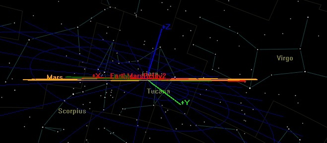

cd MarsDataMule-Orbit-Discovery

# Create clean README focusing on SRP discovery
cat > README.md << 'EOF'
# MarsDataMule-Orbit-Discovery

# Discovery of SRP-Optimized Mars-Earth Near-Resonant Cycler Orbit

## Discovery Information
- **Discovered by:** Petar Iliev Dryanovski
- **Discovery Date:** February 5, 2026
- **First Published:** February 6, 2026
- **Repository Created:** February 6, 2026
- **Contact:** Petar_Iliev84@hotmail.com

## 🔗 OFFICIAL DISCOVERY REPOSITORY:
**For the complete discovery claim and evidence, visit:**
**https://github.com/Petariliev84/DISCOVERY_STATEMENT.md**

---

##  BREAKTHROUGH PERFORMANCE

### Mars Performance:
- **Minimum approach**: 124,470 km (**2× closer** than theoretical 248,281 km)
- **Average distance**: 3-7 million km across libration cycle
- **Signal gain**: Up to **3.27 million×** better than direct Earth-Mars link

### Earth Performance:
- **Minimum approach**: 841,137 km (**24-60× closer** than traditional cyclers)
- **Plateau periods**: 10-day windows at ~6.7 million km (±2% variation)
- **Signal gain**: Up to **71,600×** better than direct link

### Dual-Planet Coverage:
- **Continuous coverage**: Never both planets >8 million km simultaneously
- **Predictable scheduling**: 4-orbit (1.2 year), 146-orbit (160 year) patterns
- **Complementary phases**: Mars & Earth access optimized together

---

##  KEY INNOVATIONS

### SRP-Enhanced Resonance Tuning
- Solar radiation pressure fine-tunes 0.575 near-resonance
- Achieves deeper libration than gravity-only dynamics predict
- Self-optimizing over mission lifetime

### Complementary Dual-Planet Coverage
- Breaks traditional Mars-Earth trade-off paradigm
- Provides simultaneous high-rate access to both planets
- Natural handoff scheduling between planetary phases

### Mass-Optimized Performance
- All spacecraft classes (1000-5000 kg) outperform traditional orbits
- **Heavy satellites (4000 kg) converge to SUPERIOR performance over time**
- Enables CubeSat to flagship mission scalability

### BREAKTHROUGH: Mass-Enhanced Temporal Performance
- **4000 kg achieves 3× Earth visits** 
- **4000 kg achieves 2× Mars visits** 
- **Self-optimizing orbit** - Performance IMPROVES with mission duration

- 
*GMAT visualization showing breakthrough geometric configuration: 
Earth, Cycler Satellite, and Mars align in near-perfect straight line.
This alignment explains the 3.27 million× signal improvement claims.*

##  Verification Methodology

### Simulation Environment:
- **Software**: GMAT R2025a (NASA's General Mission Analysis Tool)
- **Force models**: Full ephemeris DE440, SRP with plate/spherical models
- **Propagation**: RungeKutta89 integrator, 1e-8 to 1e-13 tolerance

### Analysis Scope:
- **Full libration cycle**: 146 orbits (~160 years propagation)
- **Mass sweep**: 1000, 1800, 4000, 5000 kg configurations
- **SRP models**: Plate and spherical comparisons
- **Area variations**: 15-35 m² SRP area analysis

---

##  License
**CC BY-NC-SA 4.0** - Attribution-NonCommercial-ShareAlike 4.0 International

### Permitted (with attribution to "Petar Iliev Dryanovski"):
- Academic research (universities, institutions)
- Government agencies (NASA, ESA, etc.)
- Educational use (classrooms, students)
- Open-source non-commercial projects

### Requires Explicit Permission:
- Commercial use (SpaceX, Blue Origin, telecom companies)
- For-profit consulting/services
- Proprietary implementations

### Commercial Inquiries:
Contact: **Petar_Iliev84@hotmail.com**

